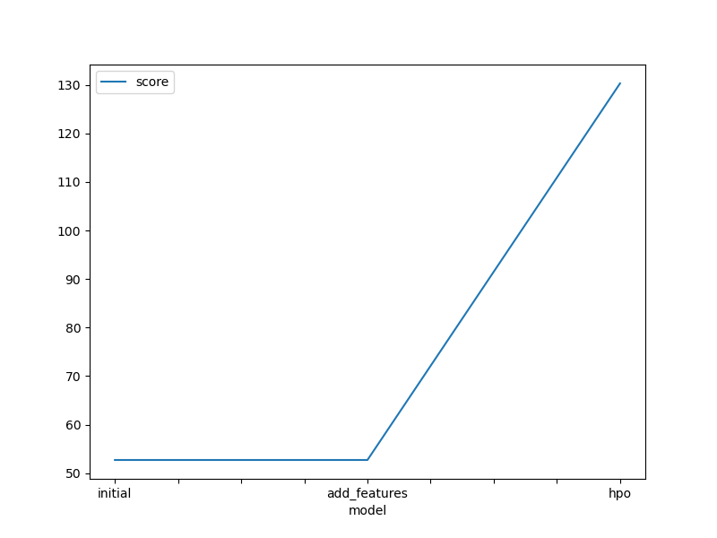
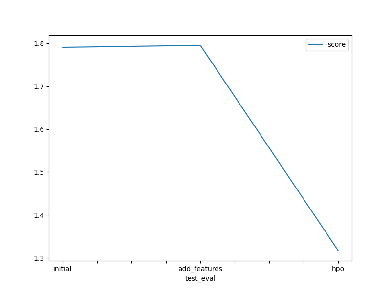

# Report: Predict Bike Sharing Demand with AutoGluon Solution
#### Luiz Cunha

## Initial Training
### What did you realize when you tried to submit your predictions? What changes were needed to the output of the predictor to submit your results?
We got good performance on WeightedEnsemble_L3 with the score of 52.663005 on the first submission, but we could improve it by tunning hyperparameters and creating new features.
### What was the top ranked model that performed?
WeightedEnsemble_L3 with an RMSE of 52.663005

## Exploratory data analysis and feature creation
### What did the exploratory analysis find and how did you add additional features?
That we had categorical data on the features season and weather. Another improvement was adding the year, month and day from the datetime column. 
### How much better did your model preform after adding additional features and why do you think that is?
Our best model, WeightedEnsemble_L3, got an score_val of -52.694214, I think it was by transforming the features season and weather to categorical. It got worst than the first model trained.

## Hyper parameter tuning
### How much better did your model preform after trying different hyper parameters?
It got worst than the previous trained models.  WeightedEnsemble_L3 model got an score_val of -130.310568.

### If you were given more time with this dataset, where do you think you would spend more time?
I would run a cluster model and after creating a regression model to each cluster to evaluate the performance. 

### Create a table with the models you ran, the hyperparameters modified, and the kaggle score.
|model|hpo1|hpo2|hpo3|score|
|--|--|--|--|--|
|initial|default|default|default|52.663005|
|add_features|default|default|default|52.694214|
|hpo|CAT_iterations|'CAT_learning_rate'| 'GBM_num_boost_round'|130.310568|

### Create a line plot showing the top model score for the three (or more) training runs during the project.

### Create a line plot showing the top kaggle score for the three (or more) prediction submissions during the project.

## Summary
Bike-sharing demand is highly relevant to related problems companies encounter, such as Uber, Lyft, and DoorDash. Predicting demand not only helps businesses prepare for spikes in their services but also improves customer experience by limiting delays.

In this project, we got the best results in the first model trained, which WeightedEnsemble_L3 got an score of 52.663005. We tried to improve it, but it got worst after adding new features and hyperparameters tunning

